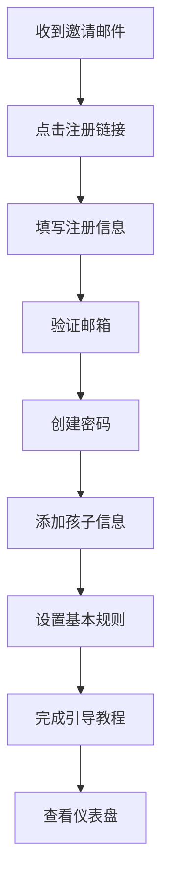
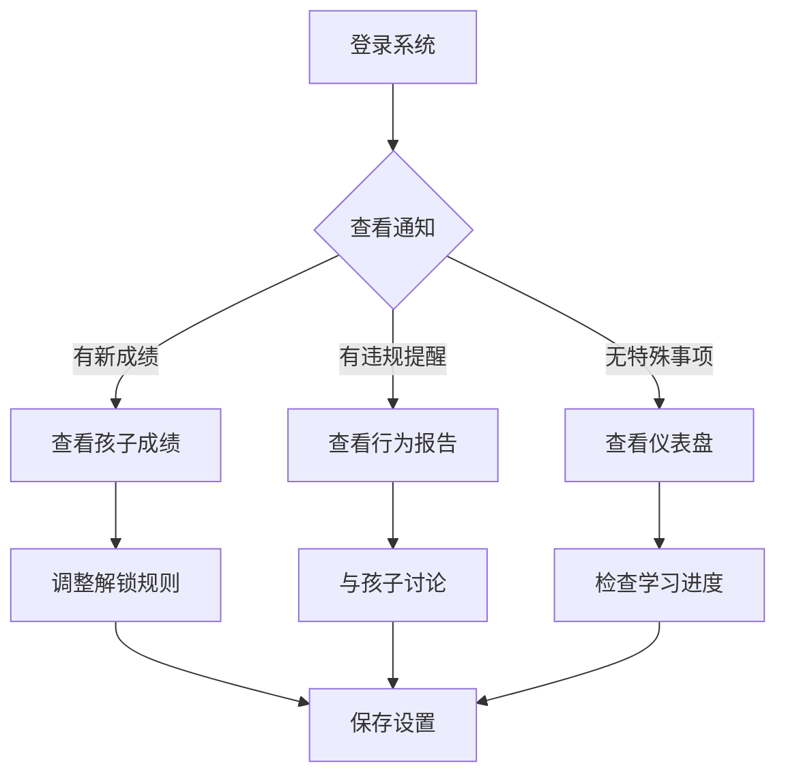
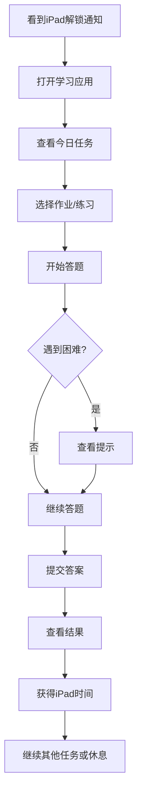
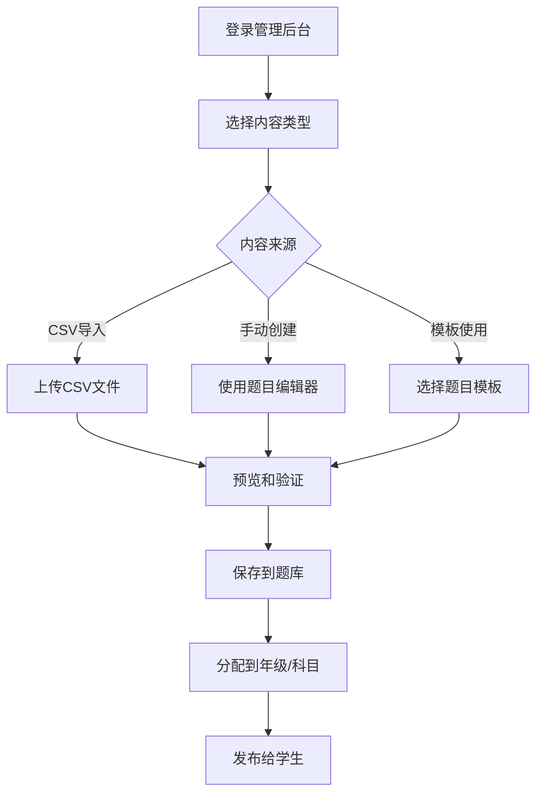

# Wireframes and User Experience Design

## 1. 用户角色和使用场景 (User Personas & Scenarios)

### 1.1 主要用户角色

#### 学生 (Student)

**Emma, 9岁, Year 3学生**

- 技能水平: 基本的设备操作能力，需要清晰的视觉指导
- 目标: 完成作业，获得iPad时间，查看学习进度
- 痛点: 复杂的界面会让她困惑，需要即时反馈来保持动机
- 使用环境: 主要在家中，可能在嘈杂的环境中使用

**Liam, 12岁, Year 6学生**

- 技能水平: 熟练的数字原住民，期望现代化的用户体验
- 目标: 高效完成作业，挑战更难的题目，管理自己的学习进度
- 痛点: 过于简单的界面会让他觉得幼稚，需要更多控制权
- 使用环境: 在家和学校，可能同时使用多个设备

#### 家长 (Parent)

**Sarah, 35岁, 两个孩子的妈妈**

- 技能水平: 中等技术水平，忙碌的工作和家庭生活
- 目标: 监控孩子学习进度，设置合理的iPad使用规则，支持孩子学习
- 痛点: 时间有限，需要快速了解孩子的学习状况
- 使用环境: 主要在手机上使用，偶尔使用电脑

#### 管理员/教师 (Admin/Teacher)

**Mrs. Johnson, 45岁, 小学教师**

- 技能水平: 教育技术专家，熟悉各种教学平台
- 目标: 创建和管理作业，分析学生表现，导入教学内容
- 痛点: 需要高效的批量操作，详细的分析数据
- 使用环境: 主要在学校的电脑上使用

## 2. 家长用户旅程 (Parent User Journey)

### 2.1 首次使用流程



### 2.2 日常使用流程



### 2.3 家长面板线框图

```
┌─────────────────────────────────────────────────────┐
│ 🏠 家长控制面板                    🔔 [3]  👤 Sarah  │
├─────────────────────────────────────────────────────┤
│                                                     │
│ 📊 今日概览                                          │
│ ┌─────────────────┐ ┌─────────────────┐              │
│ │ Emma (Year 3)   │ │ Liam (Year 6)   │              │
│ │ ✅ 英语: 92%     │ │ ✅ 数学: 88%     │              │
│ │ ⏱️  已解锁: 25分钟│ │ ⏱️  已解锁: 30分钟│              │
│ │ 📚 作业: 2/3完成 │ │ 📚 作业: 3/3完成 │              │
│ └─────────────────┘ └─────────────────┘              │
│                                                     │
│ 🎯 本周目标进度                                      │
│ Emma: ████████░░ 80%  Liam: ██████████ 100%         │
│                                                     │
│ ⚙️  快速操作                                         │
│ [设置解锁规则] [查看详细报告] [发送鼓励消息]            │
│                                                     │
│ 📈 学习趋势 (最近7天)                                │
│ ┌─────────────────────────────────────────────────┐ │
│ │     📊                                          │ │
│ │  100├─────╮                                     │ │
│ │   75│     ╰─╮   Emma                            │ │
│ │   50│       ╰───╮                               │ │
│ │   25│           ╰───Liam                        │ │
│ │    0└─────────────────────────────────────────  │ │
│ │     Mon Tue Wed Thu Fri Sat Sun                 │ │
│ └─────────────────────────────────────────────────┘ │
└─────────────────────────────────────────────────────┘
```

## 3. 学生用户旅程 (Student User Journey)

### 3.1 Year 3 学生 (Emma) 使用流程



### 3.2 学生练习界面线框图

```
┌─────────────────────────────────────────────────────┐
│ 📚 英语练习 - 阅读理解              ⏱️ 15:30  🌟 Emma │
├─────────────────────────────────────────────────────┤
│                                                     │
│ 进度: ████████░░ 8/10 题                             │
│                                                     │
│ 📖 阅读下面的段落:                                   │
│ ┌─────────────────────────────────────────────────┐ │
│ │ The kangaroo is Australia's national animal.   │ │
│ │ It has strong hind legs for jumping and a      │ │
│ │ long tail for balance. Kangaroos live in...    │ │
│ └─────────────────────────────────────────────────┘ │
│                                                     │
│ ❓ Question 8: What does the kangaroo use its      │
│    tail for?                                       │
│                                                     │
│ 🔘 A) Swimming                                     │
│ 🔘 B) Flying                                       │
│ 🔘 C) Balance                                      │
│ 🔘 D) Digging                                      │
│                                                     │
│ ┌─────────────────┐                               │
│ │ 💡 需要帮助?     │                               │
│ │ [显示提示]      │                               │
│ └─────────────────┘                               │
│                                                     │
│ [◀️ 上一题]           [检查答案]           [下一题 ▶️] │
└─────────────────────────────────────────────────────┘
```

### 3.3 结果反馈界面

```
┌─────────────────────────────────────────────────────┐
│ 🎉 太棒了, Emma!                           🌟 分数面板│
├─────────────────────────────────────────────────────┤
│                                                     │
│              🏆 练习完成!                            │
│                                                     │
│ ┌─────────────────────────────────────────────────┐ │
│ │             📊 你的成绩                          │ │
│ │                                                 │ │
│ │             正确答题: 8/10                       │ │
│ │             得分: 80%                           │ │
│ │             用时: 12分钟                         │ │
│ │                                                 │ │
│ │         🎯 目标达成: 75% ✅                       │ │
│ └─────────────────────────────────────────────────┘ │
│                                                     │
│ 🎁 解锁奖励:                                        │
│ ┌─────────────────────────────────────────────────┐ │
│ │ 📱 iPad时间: +20分钟                             │ │
│ │ 🌟 学习积分: +50分                               │ │
│ │ 🏅 成就徽章: "阅读理解专家"                       │ │
│ └─────────────────────────────────────────────────┘ │
│                                                     │
│ ❌ 错题复习 (2题):                                   │
│ [查看错题] [加入错题本]                              │
│                                                     │
│ [继续练习] [查看详细报告] [使用iPad时间]              │
└─────────────────────────────────────────────────────┘
```

## 4. 管理员用户旅程 (Admin User Journey)

### 4.1 内容管理流程



### 4.2 管理员控制台线框图

```
┌─────────────────────────────────────────────────────────────────────┐
│ 🛠️ 管理员控制台                        🔔 [2] 👤 Mrs.Johnson (Admin) │
├─────────────────────────────────────────────────────────────────────┤
│ 📋 导航菜单                                                          │
│ ├── 📊 仪表盘        ├── 📚 内容管理     ├── 👥 用户管理             │
│ ├── 📈 分析报告      ├── ⚙️ 系统设置     ├── 🔍 审计日志              │
│                                                                     │
│ 📊 系统概览                                                          │
│ ┌──────────────┐ ┌──────────────┐ ┌──────────────┐ ┌──────────────┐ │
│ │ 👥 总用户数   │ │ 📚 活跃练习   │ │ ⏱️ 今日使用量  │ │ 🎯 完成率     │ │
│ │    245       │ │     18       │ │   4.2小时    │ │    87%       │ │
│ └──────────────┘ └──────────────┘ └──────────────┘ └──────────────┘ │
│                                                                     │
│ 📋 快速操作                                                          │
│ [➕ 创建新作业] [📤 导入CSV] [📊 生成报告] [🔧 系统维护]               │
│                                                                     │
│ 📈 使用趋势                                                          │
│ ┌─────────────────────────────────────────────────────────────────┐ │
│ │ 用户活跃度 (最近30天)                                             │ │
│ │     200├─                                                       │ │
│ │     150├─╭─╮     ╭─╮                                             │ │
│ │     100├─│ ╰─╮ ╭─╯ ╰─╮                                           │ │
│ │      50├─╯   ╰─╯     ╰─╮                                         │ │
│ │       0├─────────────────╰─────────────────────────────────────  │ │
│ │        Week1  Week2  Week3  Week4                               │ │
│ └─────────────────────────────────────────────────────────────────┘ │
│                                                                     │
│ 📋 最近活动                                                          │
│ • Emma完成了数学练习 (92分) - 2分钟前                                │
│ • Liam提交了英语作业 - 15分钟前                                       │
│ • 新用户Sarah注册 - 1小时前                                           │
│ • 系统完成每日备份 - 2小时前                                          │
└─────────────────────────────────────────────────────────────────────┘
```

## 5. shadcn/ui 组件地图 (Component Map)

### 5.1 题目组件系列

#### 多选题组件 (MCQ Component)

```typescript
interface MCQComponentProps {
  question: {
    id: string;
    text: string;
    options: Array<{
      id: string;
      text: string;
      isCorrect: boolean;
    }>;
  };
  selectedAnswer?: string;
  onAnswerChange: (answerId: string) => void;
  showResult?: boolean;
  disabled?: boolean;
}

// 组件结构
<Card className="mcq-container">
  <CardHeader>
    <CardTitle>{question.text}</CardTitle>
  </CardHeader>
  <CardContent>
    <RadioGroup value={selectedAnswer} onValueChange={onAnswerChange}>
      {options.map(option => (
        <div className="flex items-center space-x-2">
          <RadioGroupItem value={option.id} />
          <Label>{option.text}</Label>
          {showResult && (
            <Badge variant={option.isCorrect ? "success" : "destructive"}>
              {option.isCorrect ? "✓" : "✗"}
            </Badge>
          )}
        </div>
      ))}
    </RadioGroup>
  </CardContent>
</Card>
```

#### 判断题组件 (True/False Component)

```typescript
<Card className="tf-container">
  <CardHeader>
    <CardTitle>{statement}</CardTitle>
  </CardHeader>
  <CardContent>
    <div className="flex justify-center space-x-8">
      <Button
        variant={selectedAnswer === true ? "default" : "outline"}
        onClick={() => onAnswerChange(true)}
        className="px-8 py-4"
      >
        ✓ True
      </Button>
      <Button
        variant={selectedAnswer === false ? "default" : "outline"}
        onClick={() => onAnswerChange(false)}
        className="px-8 py-4"
      >
        ✗ False
      </Button>
    </div>
  </CardContent>
</Card>
```

#### 匹配题组件 (Matching Component)

```typescript
<Card className="matching-container">
  <CardHeader>
    <CardTitle>将左侧项目与右侧项目匹配</CardTitle>
  </CardHeader>
  <CardContent>
    <div className="grid grid-cols-2 gap-8">
      <div className="left-column">
        {leftItems.map(item => (
          <Button
            variant="outline"
            className="mb-2 justify-start"
            draggable
            onDragStart={() => setDragSource(item.id)}
          >
            {item.text}
          </Button>
        ))}
      </div>
      <div className="right-column">
        {rightItems.map(item => (
          <div
            className="drop-zone p-4 border-dashed border-2 mb-2"
            onDrop={() => handleDrop(item.id)}
            onDragOver={e => e.preventDefault()}
          >
            {matches[item.id] || "拖拽到这里"}
          </div>
        ))}
      </div>
    </div>
  </CardContent>
</Card>
```

#### 填空题组件 (Fill-in-the-blank)

```typescript
<Card className="fill-blank-container">
  <CardHeader>
    <CardTitle>完成下列句子</CardTitle>
  </CardHeader>
  <CardContent>
    <div className="text-content">
      {textParts.map((part, index) =>
        part.isBlank ? (
          <Input
            key={index}
            className="inline-input mx-1"
            placeholder="___"
            value={answers[part.id] || ""}
            onChange={e => onAnswerChange(part.id, e.target.value)}
          />
        ) : (
          <span key={index}>{part.text}</span>
        )
      )}
    </div>
  </CardContent>
</Card>
```

### 5.2 进度和反馈组件

#### 进度条组件

```typescript
<Card className="progress-container">
  <CardHeader className="pb-3">
    <div className="flex justify-between items-center">
      <CardTitle className="text-sm font-medium">练习进度</CardTitle>
      <span className="text-sm text-muted-foreground">
        {currentQuestion}/{totalQuestions}
      </span>
    </div>
  </CardHeader>
  <CardContent>
    <Progress value={(currentQuestion / totalQuestions) * 100} />
    <div className="flex justify-between text-xs text-muted-foreground mt-2">
      <span>开始</span>
      <span>{Math.round((currentQuestion / totalQuestions) * 100)}%</span>
      <span>完成</span>
    </div>
  </CardContent>
</Card>
```

#### 计时器组件

```typescript
<Card className="timer-container">
  <CardContent className="flex items-center space-x-2 p-4">
    <Clock className="h-4 w-4" />
    <span className={`font-mono ${timeRemaining < 300 ? 'text-red-500' : ''}`}>
      {formatTime(timeRemaining)}
    </span>
    {timeRemaining < 300 && (
      <Badge variant="destructive" className="animate-pulse">
        时间不足!
      </Badge>
    )}
  </CardContent>
</Card>
```

### 5.3 结果展示组件

#### 结果摘要卡片

```typescript
<Card className="result-summary">
  <CardHeader>
    <CardTitle className="flex items-center">
      <Trophy className="h-5 w-5 mr-2" />
      练习完成!
    </CardTitle>
  </CardHeader>
  <CardContent>
    <div className="grid grid-cols-2 gap-4">
      <div className="metric">
        <div className="text-2xl font-bold">{score}%</div>
        <div className="text-sm text-muted-foreground">得分</div>
      </div>
      <div className="metric">
        <div className="text-2xl font-bold">{correctCount}/{totalCount}</div>
        <div className="text-sm text-muted-foreground">正确题数</div>
      </div>
      <div className="metric">
        <div className="text-2xl font-bold">{formatTime(timeSpent)}</div>
        <div className="text-sm text-muted-foreground">用时</div>
      </div>
      <div className="metric">
        <div className="text-2xl font-bold">+{rewardMinutes}分钟</div>
        <div className="text-sm text-muted-foreground">iPad时间</div>
      </div>
    </div>

    {achievements.length > 0 && (
      <div className="mt-4">
        <h4 className="font-medium mb-2">获得成就:</h4>
        <div className="flex flex-wrap gap-2">
          {achievements.map(achievement => (
            <Badge key={achievement.id} variant="secondary">
              {achievement.icon} {achievement.name}
            </Badge>
          ))}
        </div>
      </div>
    )}
  </CardContent>
</Card>
```

## 6. 无障碍性要求 (Accessibility Requirements)

### 6.1 WCAG 2.1 AA 合规性

#### 键盘导航

- 所有交互元素必须可通过键盘访问
- Tab键顺序符合逻辑流程
- 焦点指示器清晰可见
- 支持常用快捷键 (Enter, Space, Escape, Arrow keys)

```typescript
// 键盘导航实现示例
const handleKeyDown = (e: KeyboardEvent) => {
  switch (e.key) {
    case 'Tab':
      if (!e.shiftKey) focusNext()
      else focusPrevious()
      break
    case 'Enter':
    case ' ':
      if (focusedElement) activateElement(focusedElement)
      break
    case 'Escape':
      closeModal()
      break
    case 'ArrowUp':
    case 'ArrowDown':
      navigateOptions(e.key)
      break
  }
}
```

#### 语义HTML标签

```html
<!-- 练习结构使用正确的语义标签 -->
<main role="main" aria-labelledby="exercise-title">
  <header>
    <h1 id="exercise-title">英语阅读理解练习</h1>
    <nav aria-label="练习进度">
      <ol>
        <li aria-current="step">第8题</li>
      </ol>
    </nav>
  </header>

  <section aria-labelledby="question-heading">
    <h2 id="question-heading">问题</h2>
    <fieldset>
      <legend>选择正确答案</legend>
      <div role="radiogroup" aria-labelledby="question-heading">
        <label>
          <input type="radio" name="answer" value="A" />
          选项A
        </label>
      </div>
    </fieldset>
  </section>
</main>
```

#### ARIA 标签和属性

```typescript
interface AccessibilityProps {
  // 必需的ARIA属性
  'aria-label'?: string;
  'aria-labelledby'?: string;
  'aria-describedby'?: string;
  'aria-expanded'?: boolean;
  'aria-hidden'?: boolean;
  'aria-current'?: 'page' | 'step' | 'location' | 'date' | 'time';
  'aria-live'?: 'polite' | 'assertive' | 'off';
  role?: string;
}

// 使用示例
<Button
  aria-label="提交答案并继续下一题"
  aria-describedby="submit-help"
>
  提交
</Button>
<div id="submit-help" className="sr-only">
  点击此按钮将保存你的答案并自动进入下一题
</div>
```

### 6.2 视觉设计可访问性

#### 颜色对比度

```css
/* 确保文本对比度至少4.5:1 */
.text-primary {
  color: #1a1a1a; /* 对白色背景的对比度: 13.6:1 */
}

.text-secondary {
  color: #4a4a4a; /* 对白色背景的对比度: 9.2:1 */
}

/* 错误状态使用高对比度 */
.text-error {
  color: #d32f2f; /* 对白色背景的对比度: 5.4:1 */
  background: #ffebee;
}

/* 成功状态 */
.text-success {
  color: #2e7d32; /* 对白色背景的对比度: 4.9:1 */
  background: #e8f5e8;
}
```

#### 响应式文本缩放

```css
/* 支持200%文本缩放而不破坏布局 */
.container {
  max-width: 100%;
  overflow-x: auto;
}

.text-scalable {
  font-size: clamp(1rem, 2.5vw, 1.2rem);
  line-height: 1.5;
}

/* 确保触摸目标至少44x44px */
.touch-target {
  min-height: 44px;
  min-width: 44px;
  padding: 8px;
}
```

### 6.3 屏幕阅读器支持

```typescript
// 动态内容更新的实时播报
const announceToScreenReader = (
  message: string,
  priority: 'polite' | 'assertive' = 'polite'
) => {
  const announcement = document.createElement('div')
  announcement.setAttribute('aria-live', priority)
  announcement.setAttribute('aria-atomic', 'true')
  announcement.className = 'sr-only'
  announcement.textContent = message

  document.body.appendChild(announcement)

  // 清理
  setTimeout(() => {
    document.body.removeChild(announcement)
  }, 1000)
}

// 使用示例
const handleAnswerSubmit = () => {
  // ... 提交逻辑
  if (isCorrect) {
    announceToScreenReader('正确！答案已保存。', 'assertive')
  } else {
    announceToScreenReader('答案不正确。请重试。', 'assertive')
  }
}
```

## 7. 设计系统和样式指南 (Design System)

### 7.1 颜色调色板

```css
:root {
  /* 品牌颜色 */
  --primary: 220 70% 50%; /* 深蓝色 - 专业可信 */
  --primary-foreground: 220 70% 95%;
  --secondary: 42 87% 55%; /* 温暖黄色 - 友好积极 */
  --secondary-foreground: 42 87% 15%;

  /* 功能颜色 */
  --success: 142 71% 45%; /* 绿色 - 成功状态 */
  --warning: 38 92% 50%; /* 橙色 - 警告状态 */
  --error: 0 84% 60%; /* 红色 - 错误状态 */
  --info: 200 95% 45%; /* 浅蓝 - 信息状态 */

  /* 中性颜色 */
  --background: 0 0% 100%;
  --foreground: 224 71% 4%;
  --muted: 220 14% 96%;
  --muted-foreground: 220 8% 46%;
  --border: 220 13% 91%;

  /* 年龄特定颜色 */
  --year3-accent: 280 65% 60%; /* 紫色 - Year 3专用 */
  --year6-accent: 160 84% 39%; /* 青绿色 - Year 6专用 */
}
```

### 7.2 排版系统

```css
/* 字体设置 */
body {
  font-family:
    'Inter',
    -apple-system,
    BlinkMacSystemFont,
    sans-serif;
  font-feature-settings: 'cv02', 'cv03', 'cv04', 'cv11';
}

/* 标题层级 */
.text-4xl {
  font-size: 2.25rem;
  line-height: 2.5rem;
} /* 36px - 页面标题 */
.text-3xl {
  font-size: 1.875rem;
  line-height: 2.25rem;
} /* 30px - 章节标题 */
.text-2xl {
  font-size: 1.5rem;
  line-height: 2rem;
} /* 24px - 子标题 */
.text-xl {
  font-size: 1.25rem;
  line-height: 1.75rem;
} /* 20px - 大号正文 */
.text-lg {
  font-size: 1.125rem;
  line-height: 1.75rem;
} /* 18px - 中号正文 */
.text-base {
  font-size: 1rem;
  line-height: 1.5rem;
} /* 16px - 标准正文 */
.text-sm {
  font-size: 0.875rem;
  line-height: 1.25rem;
} /* 14px - 小字 */
.text-xs {
  font-size: 0.75rem;
  line-height: 1rem;
} /* 12px - 辅助文字 */

/* 阅读优化 */
.reading-text {
  font-size: 1.125rem;
  line-height: 1.6;
  letter-spacing: 0.025em;
  max-width: 65ch; /* 最佳阅读宽度 */
}
```

### 7.3 间距系统

```css
/* 基于8px的间距系统 */
.space-1 {
  margin: 0.25rem;
} /* 4px */
.space-2 {
  margin: 0.5rem;
} /* 8px */
.space-3 {
  margin: 0.75rem;
} /* 12px */
.space-4 {
  margin: 1rem;
} /* 16px */
.space-6 {
  margin: 1.5rem;
} /* 24px */
.space-8 {
  margin: 2rem;
} /* 32px */
.space-12 {
  margin: 3rem;
} /* 48px */
.space-16 {
  margin: 4rem;
} /* 64px */

/* 组件间距规则 */
.component-spacing > * + * {
  margin-top: 1.5rem;
}

.card-content > * + * {
  margin-top: 1rem;
}
```

这个完整的UX/UI设计文档涵盖了所有三个主要用户角色的用户旅程，详细的线框图设计，shadcn/ui组件实现，以及完整的无障碍性要求。每个部分都考虑了澳洲本地化的教育环境和儿童用户的特殊需求。
